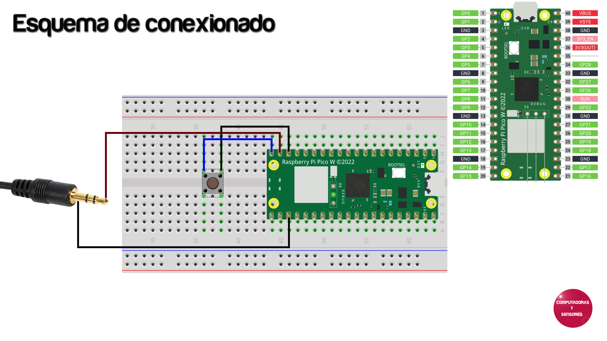

# Reproduciendo sonido por PWM con la Raspberry Pi Pico

Códigos en CircuitPython para reproducir sonido en la Raspberry Pi Pico. Recordar convertir los archivos de audio a mono y cambiar la frecuencia según lo explicado en el Capítulo 188 de YouTube

# Paso a paso

La explicación completa la podrás ver en el siguiente video de Youtube:
https://youtu.be/GqIDAPNBzNE

